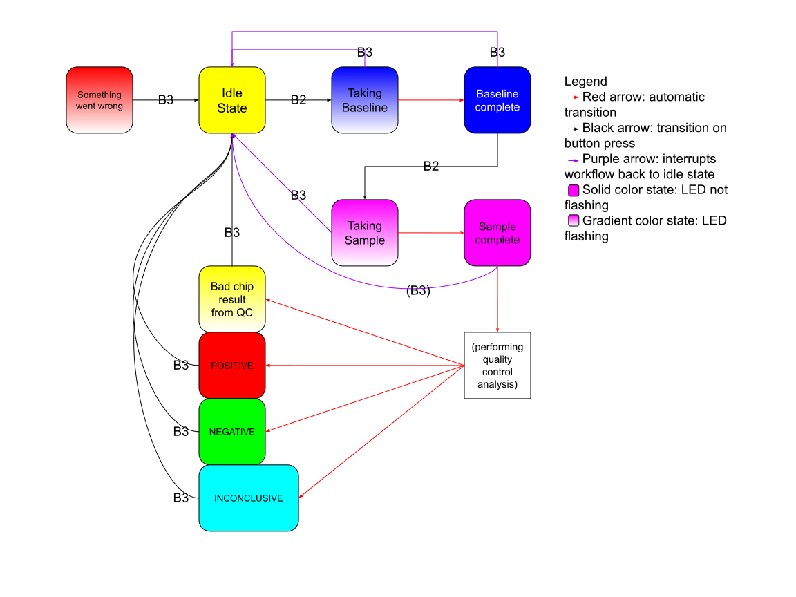

# GFET_Code

This will contain instructions on how to use this project.

## Introduction

This project aims to modernize code that was written for the Lal Lab working on a device to detect biomarkers via electrochemical means. The original state of the code was a single long "firmware" module, written in Python and engineered for a number of GFET devices which are custom-built microcontrollers; to simplify, these microcontrollers will simply be referred to as "the device." GFET stands for Graphing Field Effect Transistor.

## How to Run

There are two modes one can run the code in:
1. **Standalone mode**: One uses the device on its own, interpreting results via the LEDs installed on the GFET device. This mimics the initial code structure of one firmware module installed on the device.
2. **GUI mode**: One runs the GUI program on a computer, then connects the device to the computer by entering the IP address assigned to the device after connecting the device to the same network the computer is a part of.

### Standalone Mode 

NOTE: this uses the same string as the HELP STRING in the GFET_Code.py file.

This section describes the standalone module for the GFET device. The usage of the device is as follows:
- Button 2: Runs a baseline.
- Button 2: Runs a sample.
- Button 3: Interrupts current process to return to idle state. Any recorded data is
  discarded.

#### State Diagram

The following diagram describes the states that the 

#### Ideal Workflow

1. User powers on the device. Device is in idle state when powered on - this script
   starts as a result of powering on the device.
2. User presses button 2. This gathers baseline data and takes approximately 80-100
   seconds.
3. After baseline completes, user inserts sample in the device.
4. User presses button 2. This gathers sampling data and also takes 80-100 seconds.
   a. Once the sampling completes, a quality control test is run on both data sets
      unknown to the user. This is to ensure that the readout is not a false +/-.
   b. If the data passes the quality control step, the dirac calculation is performed.
      The result will be displayed using the LEDs.
5. After interpreting the LED lights (see below), the user will press button 3 to
   return the board to an idle state.

#### Interpreting the LED Lights:

- SOLID YELLOW: The board is in an idle state. The user should press button 2 to
  take baseline data.
- FLASHING BLUE: The board is currently taking baseline data. The user may interrupt
  this by pressing button 3, which returns the board to an idle state.
- SOLID BLUE: The board has finished taking baseline data. The user should press button
  2 to take sampling data.
- FLASHING MAGENTA: The board is currently taking sampling data. The user may interrupt
  this by pressing button 3, which returns the board to an idle state.
- SOLID MAGENTA: The board has finished taking sampling data. This color should be quite
  rare to see as the board will automatically move on to quality control analysis.
- FLASHING YELLOW: The board has calculated a bad chip result from quality control
  analysis. The user should press button 3 to return the board to an idle state.
- SOLID RED: The board has finished with a POSITIVE result - the absolute dirac
  voltage calculation exceeds the set threshold. I.E. you probably have covid. The
  user should press button 3 to return the board to an idle state.
- SOLID GREEN: The board has finished with a NEGATIVE result - the absolute dirac
  voltage calculation is within the set threshold. The user should press button 3
  to return the board to an idle state.
- SOLID CYAN: The board has finished with an INCONCLUSIVE result - the absolute
  dirac voltage calculation is within a "buffer" zone, i.e. (threshold) +- (buffer).
  The user should press button 3 to return the board to an idle state.
- FLASHING RED: Something went wrong that is not part of the predefined workflow.
  Usually this will have something to do with an error in the code and not on the
  user's part - attempting mathematics with non-numeric variables, for instance.
  The user should press button 3 to return the board to an idle state.

#### Installation:

1. Copy the GFET_driver.py file (the "standalone module") to the device using SSH. Note that currently (as of November 2023) all GFET devices do not innately have an interface and as such must be manipulated via an SSH tunnel. This device will put the standalone module into the **root directory** of the device. This is the command to run:
  - template: `scp -i [KEY_FILE] /path/to/GFET_driver.py [USER]@[IP]:~`
  - example: `scp -i ~/.ssh/id_rsa /D/GFET_code/standalone/GFET_driver.py root@192.168.0.1:~`
2. SSH into the device from a computer. This is the command to run:
  - template: `ssh -i [KEY_FILE] [USER]@[IP]`
  - example: `ssh -i ~/.ssh/id_rsa root@192.168.0.1`
3. Modify the `.bash_profile` file. This file is run when the device reboots - we will take advantage of this to create an auto-restart capability for when the device is rebooted. The idea is that the device will always be running the standalone module whenever it is on. Command to run:
  - `echo -e "python3 ~/GFET_driver.py" >> ~/.bash_profile`

### GUI Mode

This section describes how to use the GUI mode. TBW