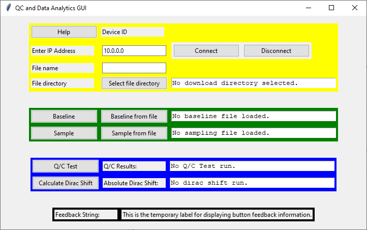

# GFET_Code

This will contain instructions on how to use this project.

## Introduction

This project aims to modernize code that was written for the Lal Lab working on a device to detect biomarkers via electrochemical means. The original state of the code was a single long "firmware" module, written in Python and engineered for a number of GFET devices which are custom-built microcontrollers; to simplify, these microcontrollers will simply be referred to as "the device." GFET stands for Graphing Field Effect Transistor.

## How to Run

There are two modes one can run the code in:
1. **Standalone mode**: One uses the device on its own, interpreting results via the LEDs installed on the GFET device. This mimics the initial code structure of one firmware module installed on the device.
2. **GUI mode**: One runs the GUI program on a computer, then connects the device to the computer by entering the IP address assigned to the device after connecting the device to the same network the computer is a part of.

### Standalone Mode 

NOTE: this uses the same string as the HELP STRING in the GFET_Code.py file.

This section describes the standalone module for the GFET device. The usage of the device is as follows:
- **Button 2**: Runs a baseline.
- **Button 2**: Runs a sample.
- **Button 3**: Interrupts current process to return to idle state. Any recorded data is discarded.

Please note that to use the standalone module, you must switch to the standalone branch. To do this run the following command: `git checkout standalone`

#### State Diagram

The following diagram describes the possible states and transitions for the device using the standalone module.


#### Ideal Workflow

1. User powers on the device. Device is in idle state when powered on - this script starts as a result of powering on the device.
2. User presses **button 2**. This gathers baseline data and takes approximately 80-100 seconds.
3. After baseline completes, user inserts sample in the device.
4. User presses **button 2**. This gathers sampling data and also takes 80-100 seconds.
   a. Once the sampling completes, a quality control test is run on both data sets unknown to the user. This is to ensure that the readout is not a false +/-.
   b. If the data passes the quality control step, the dirac calculation is performed. The result will be displayed using the LEDs.
5. After interpreting the LED lights (see below), the user will press **button 3** to return the board to an idle state.

#### Interpreting the LED Lights:

- SOLID YELLOW: The board is in an idle state. The user should press **button 2** to take baseline data.
- FLASHING BLUE: The board is currently taking baseline data. The user may interrupt this by pressing **button 3**, which returns the board to an idle state.
- SOLID BLUE: The board has finished taking baseline data. The user should press **button 2** to take sampling data.
- FLASHING MAGENTA: The board is currently taking sampling data. The user may interrupt this by pressing **button 3**, which returns the board to an idle state.
- SOLID MAGENTA: The board has finished taking sampling data. This color should be quite rare to see as the board will automatically move on to quality control analysis.
- FLASHING YELLOW: The board has calculated a bad chip result from quality control analysis. The user should press **button 3** to return the board to an idle state.
- SOLID RED: The board has finished with a POSITIVE result - the absolute dirac voltage calculation exceeds the set threshold. I.E. you probably have covid. The user should press **button 3** to return the board to an idle state.
- SOLID GREEN: The board has finished with a NEGATIVE result - the absolute dirac voltage calculation is within the set threshold. The user should press **button 3** to return the board to an idle state.
- SOLID CYAN: The board has finished with an INCONCLUSIVE result - the absolute dirac voltage calculation is within a "buffer" zone, i.e. (threshold) +- (buffer). The user should press **button 3** to return the board to an idle state.
- FLASHING RED: Something went wrong that is not part of the predefined workflow. Usually this will have something to do with an error in the code and not on the user's part - attempting mathematics with non-numeric variables, for instance. The user should press **button 3** to return the board to an idle state.

#### Installation:

1. Copy the GFET_driver.py file (the "standalone module") to the device using SSH. Note that currently (as of November 2023) all GFET devices do not innately have an interface and as such must be manipulated via an SSH tunnel. This device will put the standalone module into the **root directory** of the device. This is the command to run:
   - template: `scp -i [KEY_FILE] /path/to/GFET_driver.py [USER]@[IP]:~`
   - example: `scp -i ~/.ssh/id_rsa /D/GFET_code/standalone/GFET_driver.py root@192.168.0.1:~`
2. SSH into the device from a computer. This is the command to run:
   - template: `ssh -i [KEY_FILE] [USER]@[IP]`
   - example: `ssh -i ~/.ssh/id_rsa root@192.168.0.1`
3. Modify the `.bash_profile` file. This file is run when the device reboots - we will take advantage of this to create an auto-restart capability for when the device is rebooted. The idea is that the device will always be running the standalone module whenever it is on. Command to run:
   - `echo -e "python3 ~/GFET_driver.py" >> ~/.bash_profile`

### GUI Mode

This section describes how to use the GUI mode.

To run the GUI, simply double-click the executable file.

#### Generating the Executable File

1. Install the pyinstaller library: `pip3 install pyinstaller`. This site details how to install and use pyinstaller: https://www.pyinstaller.org/en/stable/installation.html
2. Navigate your terminal to the folder containing `main.py`, then run the following command: `python3 -m PyInstaller --onefile main.py --add-data "firmware.py;."`
3. This will create the following resources in the folder containing `main.py`:
   - A folder called `build` containing auxiliary files for the most recent exe compilation.
   - A folder called `dist` that contains the file `main.exe`. This is the executable file that launches the GUI.

#### Running the Program

When the GUI program is opened, a Windows Command Prompt window will open. This window will display print statements while the GUI loads. On successful load, it will say:
```
Loading modules...
Loading GUI...
```
Shortly after these messages appear, the GUI will load. This is what the GUI looks like:

The Command Prompt window will display debug information whenever the user takes an action on the GUI. This can be helpful for debugging the program if the GUI is not behaving as intended.

#### Controls

- Yellow section: Connection to GFET Device
   - **Help**: a button that displays the usage string, most of which is copied below.
   - **Device ID**: a read-only text field that shows the device ID of the connected device.
   - **Enter IP Address**: a text entry field for entering the IP address to connect to.
   - **Connect**: a button that connects to the IP address specified in the "Enter IP Address" field via SSH.
   - **Disconnect**: a button that disconnects from the connected microcontroller. Has no effect if not connected.
   - Select file directory: opens a folder selector popup, enabling you to choose a location to download files to from the SSH connection.
   - **File name**: a text entry field for entering the file name of the recorded data from the connected GFET device.
   - **File directory**: a folder selection button allowing the user to choose where the data files are saved to; the chosen directory is displayed in the read-only text field.
- Green section: Data Loading
   - **Baseline**: a button that runs firmware module on connected microcontroller to produce a data file in 80-90 seconds, or if the maximum timeout of 120 is reached the data collection stops and times out. Requires active SSH connection.
   - **Sample**: a button that does the exact same thing as the Baseline button.
   - **Baseline from file**: a button that opens a file selector popup, enabling you to load an existing CSV file to perform analysis on.
   - **Sample from file**: a button that does the exact same thing as the Baseline from file button.
- Blue section: Data Processing
   - **Q/C Test**: a button that runs a quality control test on the second sweep of the data. Produces hyperbolic, parabolic, moving mean, and linear approximations of the data curve, and generates a score based on the calculated parameters of all approximations. Plots results that can be saved as PNGs. Compares the most recently gathered baseline with the most recently gathered sample.
   - **Calculate Dirac Shift**: a button that calculates the absolute dirac shift between the sample and baseline. Requires both a sample and a baseline to have been run. Plots second sweep of both sample and baseline.
- Black section: Feedback String
   - **Feedback String**: a read-only text field that shows the results of the user's most recent action.

The GUI will automatically show descriptive detail in the monospace text fields following a relevant action. These text fields are selectable, meaning the user can copy-paste from them. The Device ID and Feedback String fields are not selectable.

To close out the GUI, the user may close either the GUI or the Windows Command Prompt window.

## Data Processing

This section describes the process the GUI (and also the standalone module) take to calculate the dirac voltage. TBW